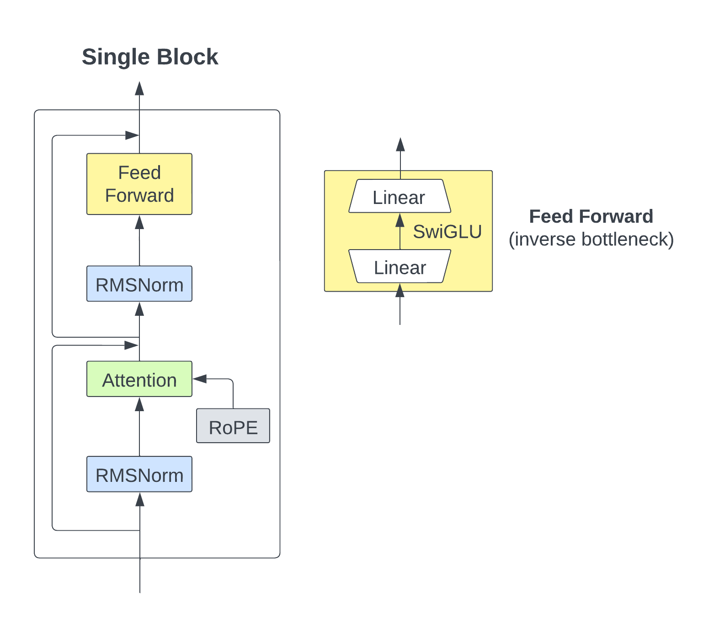

# Baby Llama From Scratch
Welcome to this deep dive into building Llama from scratch. This project is inspired by [Llama from scratch](https://github.com/bkitano/llama-from-scratch/tree/ce3e52f4f154ce16345927c4f2c5082b5ecfea13), but it diverges in several ways. For instance, we make various architectural adjustments, such as modifications to the placement of residuals and RMS normalization within each attention block, among other changes. We train a Byte-Pair Encoding (BPE) tokenizer instead of using a simple character-level tokenizer. As for optimization, we utilize the AdamW optimizer along with a cosine learning rate schedule and gradient clipping, which aligns with what is used in the original paper, rather than a basic Adam optimizer. Our implementation also uses PyTorch Lightning for more structured and maintainable code. Finally, we incorporate Weights and Biases (wandb) for experiment tracking and Hydra for configuration management.
To see the whole code, please check our [gitub repo](https://github.com/After-Hours-Research/BabyLlama).

Our project is comprehensive and, among other things, includes constructing our own attention mechanism that incorporates the three key components specified in the original Llama paper:
1. RMSNorm for pre-normalization
2. RoPE (Rotary Positional Embedding)
3. SwiGLU activation function

To help visualize the architecture, here's a diagram illustrating a single block of our model:

<div style="text-align:center">

</div>

## Setting Up the Environment
First things first: let's set up our development environment to ensure that everything runs smoothly. For this project, we'll be using Python 3.10 and manage our dependencies using Poetry. Here's how you can set it up:

```
# Create a new Conda environment named 'llama'
conda create -n llama python=3.10

# Activate the Conda environment
conda activate llama

# Install Poetry for dependency management
pip install poetry

# Install project dependencies
poetry install
```
With the environment set up, you're now ready to dive into the intricacies of building Baby Llama from scratch.

## Tokenizer Training
Given the domain-specific language characteristics of our dataset, we opted for training a custom Byte-Pair Encoding (BPE) tokenizer. This allows for more accurate and efficient tokenization specific to our corpus.

Our code snippet for training the tokenizer involves several components:
1. Initialization of a BPE tokenizer.
2. Setting pre-tokenizers and decoders to ByteLevel.
3. Configuration of special tokens and post-processors.
4. Training the tokenizer on a specific dataset specified in the cfg.path.

#### Code Walkthrough

```python
# Initialize the BPE tokenizer
tokenizer = Tokenizer(models.BPE(unk_token="[UNK]"))
```
Here, we initialize a BPE tokenizer. We specify the unknown token as `[UNK]`, which is what the tokenizer will use for any character sequences it hasn't seen before.

```python
tokenizer.pre_tokenizer = pre_tokenizers.ByteLevel(add_prefix_space=False)
tokenizer.decoder = decoders.ByteLevel()
```
These lines set the pre-tokenizer and decoder to use Byte-Level tokenization, a foundational part of BPE. This allows the BPE tokenizer to use bytes as the base vocabulary, providing an initial vocabulary size of 256.

Here, add_prefix_space=False indicates that no space will be prefixed to each word at the beginning of a sentence. 

```python
# Define the trainer and special tokens
trainer = trainers.BpeTrainer(special_tokens=["[UNK]", "[PAD]", "[BOS]", "[EOS]"])
```
Here, we specify the training settings and declare special tokens that have specific roles during both training and inference. During training, BPE identifies the most frequently occurring pairs of consecutive bytes and merges them to create new tokens. These new tokens are then represented by new bytes that don't occur in the original dataset, thus effectively expanding the vocabulary.

```python
# Add post-processor for special tokens
tokenizer.post_processor = processors.TemplateProcessing(
            single="[BOS] $A [EOS]",
            special_tokens=[("[BOS]", 2), ("[EOS]", 3)],
)
```
Post-processing is configured to automatically add `[BOS]` and `[EOS]` tokens at the beginning and end of each sequence (represented as `$A`), respectively. The numbers `2`and `3` specify the indices of `[BOS]` and `[EOS]` based on their order in the special tokens list, so they must match.

```python
# Train the tokenizer on the dataset
tokenizer.train([cfg.path], trainer)
```
Training is triggered using the `.train()` method, and it's here that all the previously set configurations come into play. The tokenizer is trained on the data specified in `cfg.path`.

```python
# Save the pretrained tokenizer
pretrained_tokenizer = PreTrainedTokenizerFast(tokenizer_object=tokenizer)
pretrained_tokenizer.save_pretrained(cfg.tokenizer_path)
```
Finally, we save the trained tokenizer using the Transformers library's `PreTrainedTokenizerFast` class. 
Upon running the pretrained_tokenizer.save_pretrained(cfg.tokenizer_path) line, three files will be created within the folder specified by cfg.tokenizer_path. These files contain necessary configurations to reload the tokenizer for future use.

#### Example: Encoding and Decoding

To illustrate the tokenizer's functionality, let's encode and decode a sample sentence:

```python
encodings = tokenizer.encode("CORIOLANUS: \n It is apart \n That I shall blush in acting, and might well \n Be taken from the people.")
decodings = tokenizer.decode(encodings.ids)
print(f"Token Ids: {encodings.ids}")
print(f"Encoded Tokens : {encodings.tokens}")
print(f"Decoded Tokens: {decodings}")
```

This produces the following output:

```
Token Ids: [2, 725, 12, 68, 67, 5327, 137, 6799, 68, 67, 9936, 104, 227, 4150, 120, 9025, 8, 109, 771, 371, 68, 67, 4391, 3236, 289, 80, 1005, 10, 3]
Encoded Tokens : ['[BOS]', 'CORIOLANUS', ':', 'Ġ', 'Ċ', 'ĠIt', 'Ġis', 'Ġapart', 'Ġ', 'Ċ', 'ĠThat', 'ĠI', 'Ġshall', 'Ġblush', 'Ġin', 'Ġacting', ',', 'Ġand', 'Ġmight', 'Ġwell', 'Ġ', 'Ċ', 'ĠBe', 'Ġtaken', 'Ġfrom', 'Ġthe', 'Ġpeople', '.', '[EOS]']
Decoded Tokens: CORIOLANUS: 
 It is apart 
 That I shall blush in acting, and might well 
 Be taken from the people.
```
Here, the example output includes the following encoded tokens: `['[BOS]', 'CORIOLANUS', ':', 'Ġ', 'Ċ', 'ĠIt', 'Ġis', 'Ġapart', ...]`. You'll notice the special character `Ġ` in the encoded tokens. This character signifies a space before a word within a sentence and is a product of the ByteLevel pre-tokenization. In ByteLevel tokenization, spaces are also encoded into specific byte tokens, and Ġ is how the model represents these spaces when followed by a word within the context of a sentence.

This example demonstrates the tokenizer's ability to encode and decode text accurately, preserving the original sentence structure and adding special tokens at the beginning and end of the sequence.

### Running the Code

To execute this tokenizer training script, simply run:

```bash
python run_tokenizer.py
```

Because we're using Hydra for configuration management, modifying aspects like the dataset path or where to save the tokenizer is straightforward. All these settings are located in the `cfg` object and are sourced from a YAML configuration file.


## Data Preparation and DataLoader
Let's now focus on the data preparation and loading.

```python
tokenizer_name = "gpt2" if cfg.dataset.tokenizer_path is None else cfg.dataset.tokenizer_path
tokenizer = AutoTokenizer.from_pretrained(tokenizer_name)
```
Here, `tokenizer_name` is set to either "gpt2" or a path to your custom tokenizer, saved in `cfg.dataset.tokenizer_path`. This allows you to switch between a custom and a pre-trained tokenizer effortlessly. For our experiments, `cfg.dataset.tokenizer_path` is the path to the folder we created in the previous "Tokenizer Training" step.

`AutoTokenizer.from_pretrained` is then used to load the tokenizer. 

```python
dataset = getfromtext(
    data_path=Path(cfg.dataset.path),
    tokenizer=tokenizer, 
    tokenizer_args=dict(return_tensors="pt", add_special_tokens=True, truncation=True, padding="max_length", max_length=cfg.model.context_len+1)
)
```
The `getfromtext` is a custom function that transfors the raw text (from `cfg.dataset.path`) into a `CLMDataset` object, which is compatible with PyTorch's `DataLoader`. 

```python 
def getfromtext(
    data_path: Path,        
    tokenizer: AutoTokenizer,
    tokenizer_args: dict
    ) -> CLMDataset:
    data = data_path.read_text().split("\n\n")
    data = [i for i in data if i]  
    return CLMDataset(data=data, tokenizer=tokenizer, tokenizer_args=tokenizer_args)
```

The `CLMDataset` class inherits from the PyTorch's `Dataset` class that takes care of tokenization and formatting of your text data, making it compatible with PyTorch's `DataLoader` and ready for training. 

Let's check the code for the two main parts of `CLMDataset`: 1) the `__getitem__` method and 2) how the arguments of the tokenizer are used.
The `__getitem__` is designed to work with PyTorch's `DataLoader`. It returns a tuple consisting of input IDs, target IDs (next token IDs for eah input ID), and the attention mask.

```python
def __getitem__(self, idx: int) -> Tuple[int, int, int]:
    return self.tokens["input_ids"][idx, :-1], self.tokens["input_ids"][idx, 1:], self.tokens["attention_mask"][idx, :-1]
```
This slicing technique creates input and target sequences by shifting one token—a common practice in next-token prediction.

The tokenizer, with its arguments, is simply called within the class as:
```python
class CLMDataset(Dataset):
    def __init__(
        self,
        data: Path,
        tokenizer: AutoTokenizer,
        tokenizer_args: dict,
    ):
        self.data = data
        self.tokens = tokenizer(self.data, **tokenizer_args)
        ...
```
The tokenizer arguments are passed down from the `getfromtext` to the `CLMDataset`. In our experiments, we use `return_tensors="pt"` to return PyTorch tensors, `add_special_tokens=True` to include special tokens in the tokenized output, `truncation=True` for handling sequences longer than the model's maximum input length, `padding="max_length"` to pad shorter sequences to the max length (in the batch), and `max_length=cfg.model.context_len+1` to set the maximum sequence length (the "+1" accounts for label-shifting during training).

Having prepared our data and made it compatible with PyTorch's `DataLoader`, the next step is to manage this data efficiently for different stages of the model training, validation, and testing. This is where `CLMDataModule` comes into play. `CLMDataModule` is a class that inherits from PyTorch Lightning's `LightningDataModule` and takes care of data loading and preparation. Here's how we use it:

```python
datamodule = CLMDataModule(
    data=dataset, 
    train_ratio=cfg.dataset.train_ratio,
    val_ratio=cfg.dataset.val_ratio, 
    test_ratio=cfg.dataset.test_ratio, 
    train_batchsize=cfg.trainer.train_batchsize, 
    val_test_batchsize=cfg.trainer.val_test_batchsize,
    num_workers=cfg.trainer.num_workers
)
```

The `CLMDataModule` class provides standard methods like `train_dataloader`, `val_dataloader`, and `test_dataloader` to return PyTorch `DataLoader` objects for each phase. These methods are quite standard, utilizing the batch sizes and number of workers specified during initialization. These loaders will use the `CLMDataset` object you provided and its `__getitem__` method to fetch batches of data. 
`CLMDataModule` also has a `setup` method that splits the dataset into training, validation, and test sets based on the provided ratios. It takes a `stage` argument to determine which splits to prepare, allowing to use different data stages without reloading the entire dataset:

```python
def setup(self, stage):
    train, val, test = random_split(
        dataset=self.data, 
        lengths=[self.train_ratio, self.val_ratio, self.test_ratio]
    )
    if stage == "fit":
        self.train, self.val = train, val
    if stage == "test":
        self.test = test
```


## Llama Architecture
Let's have an intution of the three main Llama components and implement them!

First, we initialize the Llama architecture using the following code snippet:

```python
transformer = Llama(
    vocab_size=dataset.get_vocab_size(), 
    hidden_size=cfg.model.hidden_size, 
    context_len=cfg.model.context_len, 
    causal_attention=True, 
    n_heads=cfg.model.n_heads, 
    n_blocks=cfg.model.n_blocks
)
```
where:
- `vocab_size`: size of the vocabulary, taken from the dataset you're working with.
- `hidden_size`: size of the hidden layer, specified in your hydra configuration.
- `context_len`: length of the context window for attention, also from your hydra configuration.
- `causal_attention`: boolean flag to indicate if the model should use causal (unidirectional) attention. 
- `n_heads`: number of attention heads, specified in your hydra configuration.
- `n_blocks`: number of transformer blocks (layers), also specified in your hydra configuration.

```python
class Llama(nn.Module):
    def __init__(
        self, 
        vocab_size: int, 
        hidden_size: int, 
        context_len: int,
        causal_attention: bool,
        n_heads: int,
        n_blocks: int
        ):
        super().__init__()
        self.context_len = context_len
        self.embedding = nn.Embedding(vocab_size, hidden_size)
        self.attention_block = nn.ModuleList([LlamaSelfAttentionBlock(hidden_size, context_len, causal_attention, n_heads) for _ in range(n_blocks)])
        self.unembedding = nn.Linear(hidden_size, vocab_size)
        
    def forward(self, x):
        x = self.embedding(x)
        for single_block in self.attention_block:
            x = single_block(x)
        x = self.unembedding(x)
        return x
```
The `Llama` class is defined as a subclass of PyTorch's `nn.Module`. Inside its `__init__` method:

- `self.embedding`: embedding layer that converts token IDs to vectors.
- `self.attention_block`: list of attention blocks, each handling self-attention and feed-forward operations.
- `self.unembedding`: linear layer that maps the output back to vocabulary space.

In the `forward` method, the input sequence `x` goes through the embedding layer, the list of attention blocks, and finally the unembedding layer, before it is returned as output.

This completes the architecture of our Llama model.

Let's now delve into the three main components of Llama and implement them!

### RMSNorm (Root Mean Square Layer Normalization)
RMSNorm is used to normalize the input of each attention block. The inspiration for including pre-normalization comes from GPT-3, which showed that it improves training stability compared to output normalization.

RMSNorm is computationally simpler and more efficient than LayerNorm due to its utilization of root mean square for re-scaling and its lack of re-centering invariance.

Here's a simplified RMSNorm code snippet to give you an idea:

```python
class RMSnorm(nn.Module):
    def __init__(
        self, 
        size: int,
        eps: float = 1e-5, 
    ):
        super(RMSnorm, self).__init__()
        self.eps = eps
        self.gamma = nn.Parameter(torch.ones(size), requires_grad=True)
        
    def forward(self, x):
        rms = torch.sqrt((x ** 2).mean(dim=-1, keepdim=True) + self.eps) 
        x_norm = x / rms
        
        return self.gamma.unsqueeze(0).unsqueeze(1) * x_norm
```

For more mathematical and implementation details about RMSNorm and its differences with Batch Normalization and Layer Normalization, refer to our dedicated [blog post](https://afterhoursresearch.hashnode.dev/batch-normalization-layer-normalization-and-root-mean-square-layer-normalization-a-comprehensive-guide-with-python-implementations).


### RoPE (Rotary Positional Embedding)
RoPE is based on rotating queries and keys in the attention mechanism, with a unique rotation at each position. This segment of code focuses on applying the rotation in a single attention block (the full code to the attention block is down below):

```python
R_matrix = self.R[:resize[1], :, :].to(query.device)
query_rot = torch.einsum('bhld,ldd->bhld', query.permute(0,2,1,3), R_matrix)
key_rot = torch.einsum('bhdl,ldd->bhdl', key.permute(0,2,3,1), R_matrix)
```
The `self.R` is a pre-computed rotary matrix for positional encoding, `resize[1]` is the sequence length and is used to slice the rotary matrix to match the sequence length of the queries and keys.
the dimensions of query and key are ordered as [Batch size, Sequence length, Number of Heads, Hidden Dimension]. We permute these to rearrange the dimensions in a way that facilitates the subsequent operations. Specifically, we bring the sequence length (`l`) and dimension (`d`) next to each other for the rotation operation.
Let's now try to understand the `torch.einsum` operation! Here, the expression 'bhld,ldd->bhld' indicates the following:

- `bhld`: Represents batch size (`b`), number of heads (`h`), sequence length (`l`), and hidden dimension (`d`) - of each head - for the query.
- `ldd`: Stands for sequence length (`l`) and hidden dimension (`d`), twice to align with the square `R_matrix`.
- `->bhld`: Tells us that the output should maintain the original dimensions of batch size, number of heads, sequence length, and dimension.
In this case, the `torch.einsum` function takes each slice along the `l` and `d` dimensions from `query`, multiplies it with the `R_matrix`, and sums along those dimensions. Because the output subscripts (`bhld`) are the same as the input, there is no reduction in dimensions—meaning, we get an output of the same shape as the `query`, but now each query vector has been rotated based on its position in the sequence.

For a deeper dive into RoPE, its mathematical formulation, and its practical implementation in PyTorch, check out our [blog post](https://afterhoursresearch.hashnode.dev/rope-rotary-positional-embedding).

### SwiGLU
SwiGLU is a combination of the Swish activation function and the GLU (Gated Linear Unit):

$$SwiGLU(A, B) = A \cdot Swish(B) = A \cdot (B \cdot \sigma(\beta B))$$
where $A$ and $B$ are two linear transformation, $Swish(x) = x \cdot \sigma(\beta x)$ and $\sigma$ is the sigmoid function.

Here's the essential code snippet for SwiGLU:

```python
class SwiGLU(nn.Module):
    def __init__(self, size):
        super().__init__()
        self.linearA = nn.Linear(size, size)
        self.linearB = nn.Linear(size, size)
        self.beta = nn.Parameter(torch.randn(1), requires_grad=True)

    def forward(self, x):
        swish = self.linearB(x) * torch.sigmoid(self.beta * self.linearB(x))
        return swish * self.linearA(x)
```
Following the original Llama paper, for our experiments we set `size` to $\frac{2}{3}4d$, where $d$ is the hidden size (or dimension) of our Llama model. This can be easily change using the `model.swiglu_d_moltiplier` argument of hydra config.

Now, let's put everything together to see all the code for a single Llama attention block:
```python 
def causal_mask(size, device):
    x = torch.full(size, float("-inf"))
    return torch.triu(x, diagonal=1).to(device=device)
    
class LlamaSelfAttentionBlock(nn.Module):
    def __init__(
        self,
        embedding_size: int,
        context_len: int,
        causal_attention: bool,
        n_heads: int,
        swiglu_d_moltiplier: float
        ):
        super().__init__()
        self.embedding_size = embedding_size
        self.causal_attention = causal_attention
        self.n_heads = n_heads
        assert self.embedding_size % self.n_heads == 0, f"Embedding size ({self.embedding_size}) must be divisable by the number of heads ({self.n_heads})"
        self.head_dim = self.embedding_size // self.n_heads
        self.R = get_rotary_matrix(context_len=context_len, embedding_dim=self.head_dim)   
        self.rms = RMSnorm(size=embedding_size)
        self.ff_k = nn.Linear(embedding_size, embedding_size, bias=False)
        self.ff_q = nn.Linear(embedding_size, embedding_size, bias=False)
        self.ff_v = nn.Linear(embedding_size, embedding_size, bias=False)
        
        # In Llama paper swiglu_d_moltiplier = 2/3 * 4 
        swiglu_size = int(swiglu_d_moltiplier * embedding_size)
        self.fc1 = nn.Linear(embedding_size, swiglu_size)
        self.activation = SwiGLU(size=swiglu_size)
        self.fc2 = nn.Linear(swiglu_size, embedding_size)
    
    def forward(self, x):
        input_shape = x.shape
        resize = (x.shape[0], x.shape[1], self.n_heads, self.head_dim)
        x_res = x
        x = self.rms(x) # pre-normalization
        query = self.ff_q(x).reshape(resize)
        key = self.ff_k(x).reshape(resize)
        value = self.ff_v(x).reshape(resize)
                
        # Apply rotation to query and key, separatly for each head  
        R_matrix = self.R[:resize[1], :, :].to(query.device) 
        query_rot = torch.einsum('bhld,ldd->bhld', query.permute(0,2,1,3), R_matrix)
        key_rot = torch.einsum('bhdl,ldd->bhdl', key.permute(0,2,3,1), R_matrix)
        
        score = query_rot @ key_rot
        if self.causal_attention:
            score += causal_mask(size=score.shape, device=score.device)
        score = score / torch.sqrt(torch.tensor(self.head_dim)) 
        attention = torch.softmax(score, dim=-1) 
        x = attention @ value.permute(0,2,1,3)
        x = x.permute(0, 2, 1, 3).reshape(input_shape)
        x += x_res
        
        x_res = x
        x = self.rms(x)
        x = self.fc1(x)
        x = self.activation(x)
        x = self.fc2(x)
        return x + x_res
```
This reflects the architecture in the diagram included at the beginning of this post.

## Lightning Module
Let's now take advantage of `LightningModule` to easily define the training, validation and test loop, the optimizer and the learning rate scheduler as well as the prediction (we will call it `generation`). 

The `SimpleModule` is our custumized class that inherits from `LightningModule`. The `SimpleModule` class starts by taking in two main components: the model architecture (here our Llama architecture defined above) and the tokenizer (again, defined above). Here's how you would instanziate `SimpleModule`:

```python
model = SimpleModule(
    transformer, 
    tokenizer=tokenizer
)
```
And how `SimpleModule` is initialized:

```python
class SimpleModule(pl.LightningModule):
    def __init__(
        self, 
        model: nn.Module,
        tokenizer: AutoTokenizer,
        ):
        super().__init__()
        self.model = model
        self.loss = nn.CrossEntropyLoss(ignore_index=tokenizer.pad_token_id)
        self.tokenizer = tokenizer
        self.logger_table_data = []
```
The `tokenizer` is used to specify the pad token to ignore when calculatin the loss, if not specified the default value the loss will ignore is -100.

The `self.logger_table_data` is a list we will use to log some examples at the end of each validation on wandb - we will see how do to it later in our post.

Our `forward` method is straightforward, calling the `forward` method of our `self.model`:

```python
def forward(self, x):
    return self.model(x)
```

Also the `training_step`, `validation_step` and `test_step` are standard, these methods handle what happens during each training, validation and test step. We will include here only the code for `training_step`, as they will all call the `_get_preds_loss` to get the loss of the current batch and log it:

```python 

def _get_preds_loss(self, batch):
    x, y, _ = batch
    y_hat = self.model(x)
    loss = self.loss(y_hat.view(-1, y_hat.shape[-1]), y.view(-1))
    return y_hat, loss

def training_step(self, batch, batch_idx):
    _, loss = self._get_preds_loss(batch)
    self.log('train_loss', loss)
    return loss
```

Remember, the `__getitem__` method in `CLMDataset` returns input tokens, target tokens (input tokens shifted by one position), and attention masks, which are unpacked here using `x, y, _ = batch`.
Also, as always, tensor reshaping is crucial for calculating the loss properly!

Now let's see how we can generate some examples (using `generate` - we will include the code for it in a bit!) and log them at the end of each validation step using the `on_validation_end` method:
```python
def on_validation_end(self) -> None:
    _, output_decoded = self.generate(context_len=self.model.context_len, max_output_token=50)
    print(f"Full Text: \n{output_decoded}")
    current_epoch = len(self.logger_table_data) -1
    self.logger_table_data.append([current_epoch, output_decoded])
    self.logger.log_table(key="Example Text Generation", columns=["Epoch", "Text"], data=self.logger_table_data, )
    return super().on_validation_end()
```

`LightningModule` also allows to easily configure the optimizer by overwriting the `configure_optimizers` method in our custom `SimpleModule`:
```python
def configure_optimizers(self):
    max_step = self.trainer.max_epochs * (len(self.trainer.datamodule.train_dataloader()))
    optimizer = torch.optim.AdamW(self.parameters(), lr=3e-4, weight_decay = 0.1, betas=(0.9, 0.95))
    scheduler = {
        'scheduler': OneCycleLR(
            optimizer,
            max_lr=3e-4,  
            total_steps=max_step,  
            pct_start=0.03, 
            anneal_strategy='cos', 
        ),
        'interval': 'step',
        'frequency': 1
    }
    return {'optimizer': optimizer, 'lr_scheduler': scheduler}
```

This method returns a dictionary containing the optimizer and the learning rate scheduler to be used by the PyTorch Lightning `Trainer` - which we'll define in a sec!
The optimizer is `AdamW` (very straightforward to use!) and the learning rate scheduler is used to set the learning rate of each parameter group according to the 1cycle learning rate policy (`OneCycleLR`). Let's see all the components:
- `max_lr=3e-4`: sets the maximum learning rate.
- `total_steps=max_step`: aligns the total number of steps with the calculated `max_step`. Where the maximum number of step is the maximimum number of epochs moltiplied for the number of batches in out training set.
- `pct_start=0.03`: specifies that 3% of the total steps will be used for the warm-up phase.
- `anneal_strategy='cos'`: uses cosine annealing for the learning rate schedule.
- `interval`: specifies the scheduler should update at every step, as an alternative we could update it at every epoch.
- `frequency`: sets the update frequency to 1, meaning the scheduler updates every time it's called.

Since our `SimpleModule` inherits from `LightningModule`, it has several built-in attributes and methods, among which `self.logger` (used in our `on_validation_end`) and `self.trainer` (used in `configure_optimizers`). When we will create our `Trainer` object (later in our post) and define our custum attributes `logger` and `trainer`, PyTorch Lightning internally will set both `self.logger`  and `self.trainer` within our `LightningModule` (`SimpleModule`) - one more reason to use Lightning!


## Token Generation: Where the Magic Happens
One of the exciting parts of `SimpleModule` is its token generation capabilities. Whether you want to use greedy decoding, random sampling, top-k, or top-p sampling, it has you covered.

The `_single_generate` method in `SimpleModule` generates a single token based on various strategies. You can control the behavior using the arguments like `temperature`, `top_k`, `top_p`, and `greedy`.

```python
def _single_generate(self, idx, context_len, temperature, top_k, top_p, greedy):
    logits = self(idx[:, -context_len:])[:, -1, :]
    logits = logits / temperature
    
    if greedy:
        return torch.argmax(logits, dim=1).reshape(-1, 1)
    
    # Initialize mask with ones
    mask = torch.ones_like(logits).bool()
    
    if top_p > 0.0:
        sorted_logits, sorted_indices = torch.sort(logits, descending=True)
        cumulative_probs = torch.cumsum(torch.softmax(sorted_logits, dim=1), dim=1)
        sorted_mask = cumulative_probs > top_p
        # Ensure at least the most probable is included if sorted_mask contains all True 
        if sorted_mask.all():
            sorted_mask[..., :1] = 0
        to_scatter = sorted_mask.type_as(logits) * float('-inf')
        to_scatter[sorted_mask == 0] = logits.gather(1, sorted_indices)[sorted_mask == 0]
        logits.scatter_(1, sorted_indices, to_scatter)
    elif top_k > 0:
        top_k = min(top_k, logits.shape[1])            
        values, _ = torch.topk(logits, top_k)
        # smallest allowed value
        kth_values = values[..., -1]
        logits = torch.where(logits < kth_values.unsqueeze(-1), torch.tensor(float('-inf')).type_as(logits), logits)

                
    probs = torch.softmax(logits, dim=1)
    m = Categorical(probs)
    idx_next_token = m.sample()
    return idx_next_token.reshape(-1, 1)

```
Let's check how to use the different strategies using `_single_generate`:

1. **Greedy Decoding**: chooses the most likely next token at each time step.
    - Set `greedy=True`.
2. **Random Sampling**: samples from the distribution of next tokens.
    - Set ``greedy=False`` and both `top_k=0` and `top_p=0`.
3. **Top-k Sampling**: samples from the top k most likely next tokens.
    - Set `top_k` to a value greater than 0 and `top_p=0`.
4. **Top-p (nucleus) Sampling**: samples from the smallest set of tokens whose cumulative probability exceeds `p`.
    - Set `top_p` to a value between 0 (non-included) and 1.
5. **Temperature**: controls the randomness. Higher values make the output more random, and lower values make it more focused on high-probability tokens. This is used to increase the probability of probable tokens while reducing the one that is not.
    - Adjust `temperature` to control the randomness.

What if we want to generate more than a single token? For that, we can use the `generate` method in `SimpleModule`. This function generates multiple tokens by utilizing `_single_generate` for each token and then uses the tokenizer to decode the generated token IDs.

```python
def generate(self, context_len, max_output_token, temperature=1, top_k=0, top_p=0.9, greedy=False):
    idx = torch.tensor([self.tokenizer.bos_token_id]).unsqueeze(0).to(self.device)
    for _ in range(max_output_token):
        next_token = self._single_generate(idx, context_len, temperature, top_k, top_p, greedy)
        idx = torch.cat([idx, next_token], dim=1)
        if next_token.item() == self.tokenizer.eos_token_id:
            break
    decoded = self.tokenizer.decode(idx[0], skip_special_tokens=False)
    return idx, decoded
```

## Trainer 
Let's now explore the `ModelTrainer` class, a wrapper that configures and runs training using PyTorch Lightning. This class not only handles the model training but also integrates seamlessly with Weights and Biases (wandb) for experiment tracking.

First, here is the code to initialize the `ModelTrainer` and use it to train our `model`:
```python
lr_monitor_callback = LearningRateMonitor(logging_interval='step')

checkpoint_callback = ModelCheckpoint(
    monitor='val_loss',
    mode='min',
    save_last=False,  
    filename='{epoch}-{val_loss:.2f}',
    auto_insert_metric_name=False 
)

modeltrainer = ModelTrainer(
    wandb_project_name=cfg.wandb_project_name, 
    wandb_entity_name=cfg.wandb_entity_name, 
    wandb_disable_log=cfg.wandb_disable_log, 
    model=model,
    datamodule=datamodule,
    max_epochs=cfg.trainer.max_epochs,
    check_val_every_n_epoch=cfg.trainer.check_val_every_n_epoch,
    callbacks=[lr_monitor_callback, checkpoint_callback]
    )


trainer = modeltrainer.train()
modeltrainer.wandb_logger.experiment.config.update(OmegaConf.to_container(cfg))
```
Once again, we take advantage of `Lightning`, here to: 1) automatically monitor and logs learning rate during training (`LearningRateMonitor`) and 2) save the model periodically by monitoring the validation loss (`ModelCheckpoint`). We do that using two of the built-in callbacks of `Lightning`. We can think of callbacks as planned function calls at specific location that allow you to inject custom behavior into the training loop without having to modify the core training logic.

This is as easy as passing the callbacks to the `Trainer` (inside our custom `ModelTrainer`) in an array of Callback class instances.

Our `ModelTrainer` is a straightforward class that looks like it:

```python 

class ModelTrainer:
    def __init__(
        self, 
        wandb_project_name,
        wandb_entity_name,
        wandb_disable_log,
        model, 
        datamodule, 
        max_epochs,
        check_val_every_n_epoch,
        callbacks
        ):

        self.wandb_project_name = wandb_project_name
        self.wandb_entity_name = wandb_entity_name
        self.wandb_disable_log = wandb_disable_log
        self.model = model
        self.datamodule = datamodule
        self.max_epochs = max_epochs
        self.check_val_every_n_epoch = check_val_every_n_epoch
        self.callbacks = callbacks

        self.wandb_logger = self._wandb_init()
        self.wandb_logger.watch(self.model)

    def _wandb_init(self):
        return WandbLogger(
            project=self.wandb_project_name, 
            entity=self.wandb_entity_name, 
            offline=self.wandb_disable_log
            )
    
    def wandb_close(self):
        self.wandb_logger.experiment.unwatch(self.model)
        self.wandb_logger.experiment.finish()

    def train(self):
        trainer = Trainer(
            max_epochs=self.max_epochs, 
            callbacks=self.callbacks, 
            logger=self.wandb_logger, 
            check_val_every_n_epoch=self.check_val_every_n_epoch, 
            gradient_clip_val=1.0,
            gradient_clip_algorithm="norm",
            num_sanity_val_steps=None
            )
        trainer.fit(model=self.model, datamodule=self.datamodule)
        return trainer
```

The `Trainer` is a standard `Lightning` trainer, it is worth noticing that here we use gradient clipping to avoid exploding gradients. The `gradient_clip_val=1.0` sets the maximum allowable value for the gradients during backpropagation and `gradient_clip_algorithm="norm"` part specifies that the L2 norm is used for the clipping.

The `logger=self.wandb_logger` part integrates wandb for logging and experiment tracking.
Where `self.wandb_logger` is defined as `WandbLogger`, a specialized logger provided by `PyTorch Lightning` to interface seamlessly with wandb. This logger makes it easy to log all sorts of training metadata directly to the wandb interface, where you can visualize it in real-time.

In the code snippet above (how to initialize and call `ModelTrainer`) we used this logger to update the wandb experiment configuration:

```python
modeltrainer.wandb_logger.experiment.config.update(OmegaConf.to_container(cfg))
```
Here, the experiments configuation are handled using Hydra.


## Generation Examples
Right, now that we have trained our Llama model, let's use it for tokens generation!
For that, let's compare some examples of tokens generation using the different sampling methods described above:

```python 
generation_config = {"greedy": {"temperature":1, "top_k":0, "top_p":0.0, "greedy":True}, 
                        "rnd_sampling": {"temperature":1, "top_k":0, "top_p":0.0, "greedy":False},
                        "rnd_sampling_t": {"temperature":0.7, "top_k":0, "top_p":0.0, "greedy":False},
                        "topk_sampling": {"temperature":1, "top_k":40, "top_p":0.0, "greedy":False},
                        "topk_sampling_t": {"temperature":0.7, "top_k":40, "top_p":0.0, "greedy":False},
                        "topp_sampling": {"temperature":1, "top_k":0, "top_p":0.9, "greedy":False},
                        "topp_sampling_t": {"temperature":0.7, "top_k":0, "top_p":0.9, "greedy":False},
                        }


for conf_k, conf_v in generation_config.items():
    _, outputs_decoded = model.generate(context_len=cfg.model.context_len, max_output_token=300, **conf_v)
    print(f"\nFull Text, {conf_k}: \n{outputs_decoded}")
```

This produces the following results:
```
Full Text, greedy: 
[BOS]KING RICHARD III:
And be a happy mother by the deed.[EOS]

Full Text, rnd_sampling: 
[BOS]CATESBY:
Madam, his majesty doth call for you,
And for your grace; and you, my noble lords.[EOS]

Full Text, rnd_sampling_t: 
[BOS]DUKE VINCENTIO:
Good morning to you, fair and gracious daughter.[EOS]

Full Text, topk_sampling: 
[BOS]LUCIO:
I believe thee; for I think thou never wast where
grace was said.[EOS]

Full Text, topk_sampling_t: 
[BOS]First Servingman:
But when goes this forward?[EOS]

Full Text, topp_sampling: 
[BOS]KATHARINA:
 Buckingham, I say, sir, that I do love.[EOS]

Full Text, topp_sampling_t: 
[BOS]PETRUCHIO:
I see you do not mean to part with her,
Or else you like not of my company.[EOS]
```

Remember, `[BOS]` and `[EOS]` are the special tokens we defined to describe the beginning and end of sentence. 

The results are not perfect, but we think they look very promising since we are only training for 10 epochs, using a small nework (8 layers), hidden dimesion (1024), context lenght (256) and training batch size (8). You can check the [wandb run](https://wandb.ai/sara/baby_llama/runs/wk7kkl37/overview?workspace=user-sara) to see all the configurations and generation examples during traing for this experiment.

The whole code for training our Llama model and to generate some examples can easily be run with:
```python
python baby_llama/run.py
```

If you want to run experiments using different configurations (e.g. number of epochs, hidden dimension, etc.), you can easily do it using hydra!
By running `python baby_llama/run.py -h` you can see what arguments you can change to run you experiment:
```bash
== Configuration groups ==
Compose your configuration from those groups (group=option)

dataset: tinyshakespeare
model: llama
trainer: standard


== Config ==
Override anything in the config (foo.bar=value)

dataset:
  name: tinyshakespeare
  path: /home/sara/github_code/BabyLlama/data/tinyshakespeare.txt
  tokenizer_path: /home/sara/github_code/BabyLlama/data/tokenizer/
  train_ratio: 0.8
  val_ratio: 0.2
  test_ratio: 0.0
model:
  context_len: 256
  hidden_size: 1024
  n_heads: 8
  n_blocks: 8
  swiglu_d_moltiplier: 2.67
trainer:
  max_epochs: 10
  check_val_every_n_epoch: 1
  num_workers: 4
  train_batchsize: 8
  val_test_batchsize: 8
wandb_project_name: baby_llama
wandb_entity_name: sara
wandb_disable_log: false
```

